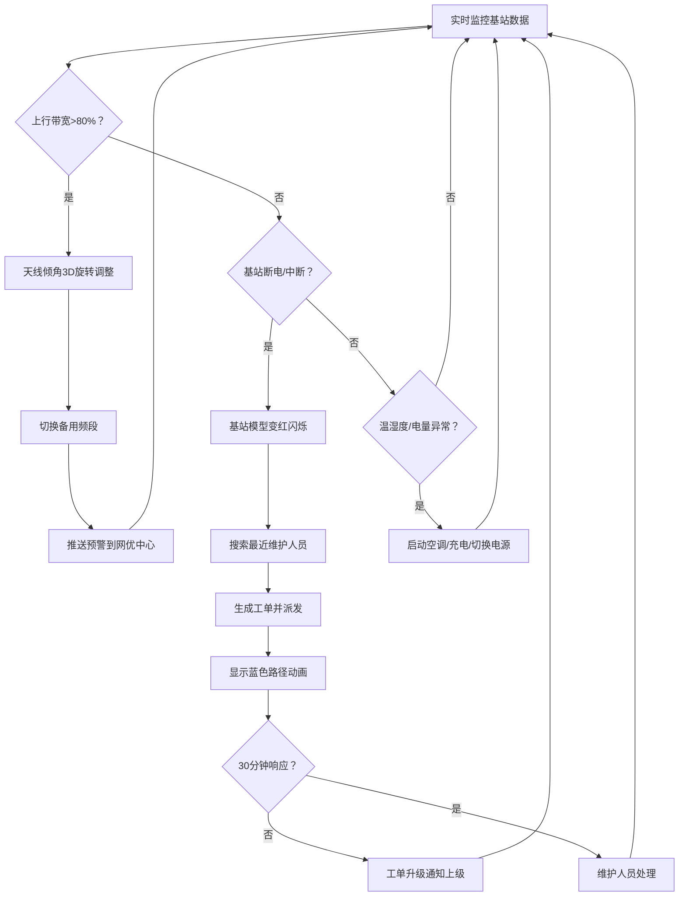
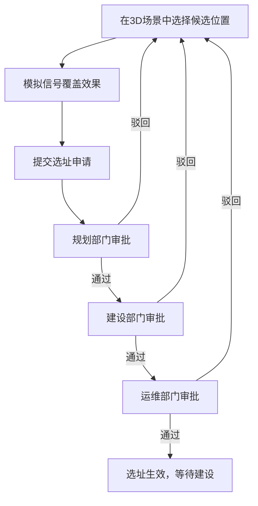

## 1. 产品概述

城市通信基站运维与网络优化三维可视化管控平台，面向通信运营商的网络优化与运维管理团队，提供基于3D GIS的基站全生命周期可视化管控能力。平台整合宏基站、微基站、室内分布系统及核心机房的实时监控、自动化运维、工单调度、选址规划、无人机巡检与报表分析功能，旨在提升运维效率、降低故障率、缩短故障响应时间。

## 2. 核心功能

### 2.1 用户角色

| 角色 | 登录方式 | 核心权限 |
|------|----------|----------|
| 网优员 | 人脸识别登录 | 基站监控查看、流量数据分析、告警确认、日报导出 |
| 运维主任 | 人脸识别登录 | 全部网优员权限、工单调度与审批、基站选址二级审批、人员管理 |
| 省公司管理员 | 人脸识别登录 | 全部权限、选址终审、系统配置、操作日志审计 |

### 2.2 功能模块

1. **登录页**：人脸识别登录、权限校验、操作日志记录
2. **3D监控主面板**：城市3D场景、各类基站模型、实时数据标签、告警状态、全局统计指标
3. **基站详情面板**：24小时流量曲线、故障记录、设备状态、环境参数
4. **告警与自动化中心**：带宽预警与天线自动调整、故障告警与工单派发、温湿度与电源自动控制
5. **工单管理系统**：工单列表、维修路径动画、响应超时升级、工单历史
6. **基站选址规划**：3D选址模拟、覆盖效果预览、三级审批流程
7. **无人机巡检**：预设航线、自动巡检、异常拍照、自动工单
8. **数据报表中心**：日报Excel导出、多维度统计图表
9. **系统管理**：权限配置、操作日志、人脸库管理

### 2.3 页面详情

| 页面名称 | 模块名称 | 功能描述 |
|----------|----------|----------|
| 登录页 | 人脸识别区域 | 摄像头实时预览、人脸检测、身份识别、登录按钮 |
| 登录页 | 登录信息展示 | 当前系统时间、登录提示、错误反馈 |
| 3D监控主面板 | 3D场景区 | 城市地形、建筑群、宏基站/微基站/室内分布/核心机房3D模型、可交互旋转缩放 |
| 3D监控主面板 | 实时数据标签 | 基站编号、在线用户数、上下行流量、告警状态（绿/黄/红） |
| 3D监控主面板 | 顶部状态栏 | 全局基站数、在线率、当前告警数、活跃工单数 |
| 3D监控主面板 | 左侧功能导航 | 监控中心、工单管理、选址规划、无人机巡检、报表中心、系统设置 |
| 3D监控主面板 | 右侧告警面板 | 实时告警列表、告警级别、告警时间、处理状态 |
| 基站详情面板 | 流量曲线图 | 近24小时上行/下行流量趋势、带宽阈值标线 |
| 基站详情面板 | 故障记录列表 | 历史故障时间、类型、处理结果、处理时长 |
| 基站详情面板 | 设备状态卡片 | 天线倾角、当前频段、温度、湿度、电池电量、供电状态 |
| 告警与自动化中心 | 带宽预警处理 | 上行带宽>80%触发天线倾角3D旋转动画、切换备用频段、推送预警 |
| 告警与自动化中心 | 故障告警处理 | 基站断电/传输中断模型变红、自动派单、30分钟未响应自动升级 |
| 告警与自动化中心 | 环境自动控制 | 温度>45℃或湿度>90%启动空调3D出风动画、电池<70%自动充电、市电中断自动切换供电 |
| 工单管理系统 | 工单列表 | 工单号、基站、故障类型、派单时间、响应状态、处理人员 |
| 工单管理系统 | 维修路径动画 | 蓝色路径动态展示维护人员到基站的导航路线 |
| 基站选址规划 | 3D选址工具 | 在3D场景中点击选址、显示候选位置信息 |
| 基站选址规划 | 覆盖效果模拟 | 信号覆盖范围热力图、与周边基站干扰分析 |
| 基站选址规划 | 三级审批流 | 规划→建设→运维三级电子审批、审批意见、审批状态追踪 |
| 无人机巡检 | 航线管理 | 预设巡检航线、3D航线路径可视化 |
| 无人机巡检 | 自动巡检 | 无人机按航线飞行动画、实时摄像头画面、异常检测 |
| 无人机巡检 | 异常处理 | 天线松动自动拍照上传、自动生成维修工单 |
| 数据报表中心 | 日报导出 | 按日期选择、导出Excel含各基站平均用户数、流量、告警次数、工单响应时间 |
| 数据报表中心 | 统计图表 | 趋势图、柱状图、饼图等多维度数据可视化 |
| 系统管理 | 操作日志 | 操作人、操作时间、操作类型、操作详情 |
| 系统管理 | 权限配置 | 角色权限分配、用户管理 |

## 3. 核心流程

### 3.1 告警与自动化处理流程

用户登录系统后，3D场景实时展示基站状态。当某基站上行带宽超过80%阈值时，系统自动触发：该基站天线3D旋转动画调整倾角、自动切换至备用频段、预警消息推送到网优中心右侧告警面板。当基站断电或传输中断时，基站模型变红闪烁，系统自动搜索最近维护人员，生成维修工单并派发，3D场景中显示蓝色动态路径从维护人员位置指向故障基站，超过30分钟未接单则自动升级工单级别并通知上级。

### 3.2 基站选址审批流程

## 4. 用户界面设计

### 4.1 设计风格

- **主色调**：深空蓝 (#0A1628) 作为背景主色，科技感青色 (#00E5FF) 作为主要强调色，警告黄 (#FFB020)、危险红 (#FF3D57)、正常绿 (#00E676) 作为状态色
- **按钮风格**：圆角科技感按钮，边框发光效果，悬停时颜色加深并伴有微弱光晕
- **字体**：使用 Orbitron 作为数字和标题字体（科技感），Inter 作为正文字体
- **布局风格**：全屏沉浸式3D场景为中心，四周浮动半透明玻璃拟态面板，顶部状态栏、左侧导航、右侧告警面板
- **图标风格**：线性科技感图标，使用 lucide-react 图标库，统一尺寸与颜色
- **整体氛围**：赛博朋克科技风，深色背景配合霓虹光效，HUD风格UI元素，数据流线条动画

### 4.2 页面设计概览

| 页面名称 | 模块名称 | UI元素 |
|----------|----------|--------|
| 登录页 | 人脸识别区域 | 居中圆形摄像头预览框、扫描线动画、人脸检测框、底部发光登录按钮 |
| 登录页 | 背景 | 粒子动画背景、科技感网格线、缓慢旋转的3D基站线框模型 |
| 3D监控主面板 | 3D场景区 | 全屏WebGL渲染场景、夜景城市灯光效果、基站模型带发光标签、鼠标悬停高亮 |
| 3D监控主面板 | 顶部状态栏 | 半透明深色背景、发光数字指标、状态颜色标签 |
| 3D监控主面板 | 左侧导航 | 垂直图标导航、选中项青色高亮、悬停展开文字标签 |
| 3D监控主面板 | 右侧告警面板 | 可折叠玻璃面板、告警条目按颜色区分、新告警闪烁动画 |
| 基站详情面板 | 流量曲线图 | 深色背景图表、青色上行线/紫色下行线、80%阈值虚线、实时数据流点 |
| 基站详情面板 | 状态卡片 | 网格布局、每个参数带图标和进度环、异常值红色高亮 |
| 工单管理系统 | 路径动画 | 3D场景中发光蓝色虚线、粒子沿路径流动效果 |
| 基站选址规划 | 覆盖模拟 | 3D半球形半透明覆盖范围、颜色渐变热力图、信号强度等值线 |
| 无人机巡检 | 无人机模型 | 小型无人机3D模型、底部探照灯光束、飞行轨迹残影效果 |

### 4.3 响应式

- 桌面端优先设计，支持 1920×1080 及以上分辨率
- 侧边面板可折叠以适应较小屏幕
- 3D场景自适应容器尺寸，支持全屏模式切换

### 4.4 3D场景指导

- **环境/HDRI**：夜景城市环境，深蓝色天空配合远处雾气，建筑窗户发光，营造科技城市夜景氛围
- **光照设置**：主光源模拟月光冷色调，辅光使用城市面光暖色，基站模型自带点光源发光，告警时红光闪烁
- **相机设置**：透视相机，初始视角俯视城市45度角，支持鼠标拖拽旋转、滚轮缩放、右键平移
- **构图与焦点元素**：场景中心为基站密集区域，重要基站放置在视觉黄金分割点，核心机房使用更大体积模型突出
- **交互与动画**：鼠标悬停基站模型发光增强并上浮，点击触发详情面板从右侧滑入，天线调整时平滑旋转动画，空调出风使用粒子系统模拟气流
- **后处理效果**：Bloom泛光效果（使发光元素更亮眼）、轻微色差、暗角，提升赛博朋克科技感
- **性能优化**：使用LOD（细节层次）控制远处模型精度，建筑使用实例化渲染，目标帧率60fps
