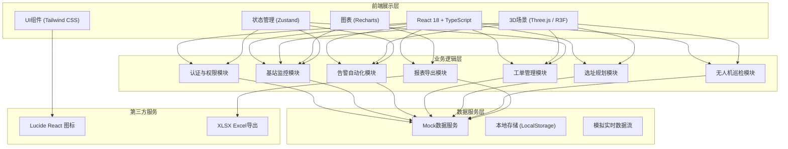
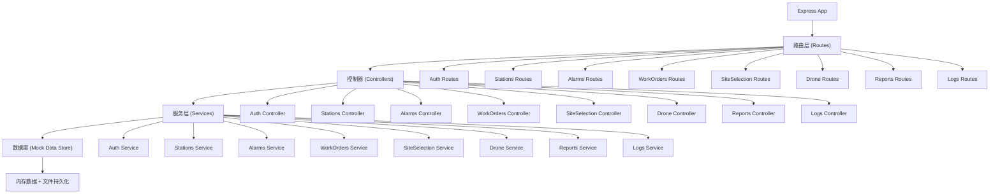
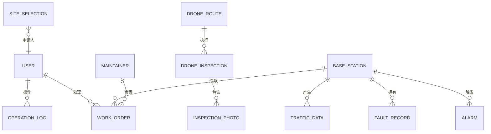

## 1. 架构设计



## 2. 技术描述

- **前端**：React@18 + TypeScript + tailwindcss@3 + vite
- **初始化工具**：vite-init（react-express-ts 模板）
- **后端**：Express@4（提供Mock API服务）
- **3D引擎**：three + @react-three/fiber + @react-three/drei + @react-three/postprocessing
- **状态管理**：zustand
- **路由**：react-router-dom
- **图表**：recharts
- **图标**：lucide-react
- **Excel导出**：xlsx
- **动画**：framer-motion（UI动画）、@react-three/fiber内置动画（3D动画）

## 3. 路由定义

| 路由 | 用途 |
|------|------|
| /login | 人脸识别登录页 |
| /dashboard | 3D监控主面板（默认首页） |
| /workorders | 工单管理页面 |
| /planning | 基站选址规划页面 |
| /drone | 无人机巡检页面 |
| /reports | 数据报表中心 |
| /settings | 系统设置与日志 |

## 4. API定义（Mock后端）

### 4.1 类型定义

```typescript
// 基站类型
type StationType = 'macro' | 'micro' | 'indoor' | 'core';

// 告警状态
type AlarmStatus = 'normal' | 'warning' | 'critical' | 'offline';

// 基站信息
interface BaseStation {
  id: string;
  name: string;
  type: StationType;
  position: { x: number; y: number; z: number };
  onlineUsers: number;
  uplinkTraffic: number; // Mbps
  downlinkTraffic: number; // Mbps
  uplinkBandwidthUsage: number; // 0-100%
  alarmStatus: AlarmStatus;
  antennaTilt: number; // 度
  currentFrequency: string;
  temperature: number; // ℃
  humidity: number; // %
  batteryLevel: number; // 0-100%
  powerSource: 'grid' | 'battery';
  airConditioning: boolean;
}

// 流量数据点
interface TrafficDataPoint {
  time: string;
  uplink: number;
  downlink: number;
}

// 故障记录
interface FaultRecord {
  id: string;
  stationId: string;
  time: string;
  type: string;
  result: string;
  duration: number; // 分钟
}

// 工单状态
type WorkOrderStatus = 'pending' | 'assigned' | 'processing' | 'completed' | 'escalated';

// 维修工单
interface WorkOrder {
  id: string;
  stationId: string;
  stationName: string;
  faultType: string;
  createTime: string;
  assignTime?: string;
  responseTime?: number; // 分钟
  status: WorkOrderStatus;
  priority: 'normal' | 'high' | 'urgent';
  maintainerId?: string;
  maintainerName?: string;
  maintainerPosition?: { x: number; y: number; z: number };
}

// 维护人员
interface Maintainer {
  id: string;
  name: string;
  phone: string;
  position: { x: number; y: number; z: number };
  status: 'idle' | 'busy';
}

// 告警
interface Alarm {
  id: string;
  stationId: string;
  stationName: string;
  type: 'bandwidth' | 'power' | 'transmission' | 'temperature' | 'humidity' | 'battery' | 'antenna';
  level: 'warning' | 'critical';
  message: string;
  time: string;
  handled: boolean;
}

// 选址申请
type ApprovalStatus = 'pending' | 'approved' | 'rejected';

interface SiteSelection {
  id: string;
  position: { x: number; y: number; z: number };
  applicant: string;
  applyTime: string;
  planningApproval: ApprovalStatus;
  planningApprover?: string;
  planningComment?: string;
  constructionApproval: ApprovalStatus;
  constructionApprover?: string;
  constructionComment?: string;
  operationApproval: ApprovalStatus;
  operationApprover?: string;
  operationComment?: string;
  coverageRadius: number;
}

// 无人机航线
interface DroneRoute {
  id: string;
  name: string;
  waypoints: { x: number; y: number; z: number }[];
}

// 无人机巡检记录
interface DroneInspection {
  id: string;
  routeId: string;
  startTime: string;
  endTime?: string;
  status: 'scheduled' | 'flying' | 'completed';
  photos: { stationId: string; url: string; issue: string; time: string }[];
}

// 用户角色
type UserRole = 'engineer' | 'director' | 'admin';

interface User {
  id: string;
  name: string;
  role: UserRole;
  faceId: string;
}

// 操作日志
interface OperationLog {
  id: string;
  userId: string;
  userName: string;
  userRole: UserRole;
  action: string;
  detail: string;
  time: string;
}

// 日报数据
interface DailyReport {
  date: string;
  stations: {
    stationId: string;
    stationName: string;
    avgUsers: number;
    avgUplink: number;
    avgDownlink: number;
    alarmCount: number;
    avgResponseTime: number;
  }[];
}
```

### 4.2 API接口

| 方法 | 路径 | 描述 |
|------|------|------|
| GET | /api/auth/users | 获取用户列表 |
| POST | /api/auth/login | 人脸识别登录 |
| GET | /api/stations | 获取所有基站列表 |
| GET | /api/stations/:id | 获取单个基站详情 |
| GET | /api/stations/:id/traffic/24h | 获取基站24小时流量数据 |
| GET | /api/stations/:id/faults | 获取基站故障记录 |
| GET | /api/alarms | 获取告警列表 |
| POST | /api/alarms/:id/handle | 处理告警 |
| GET | /api/workorders | 获取工单列表 |
| POST | /api/workorders | 创建工单 |
| PUT | /api/workorders/:id/status | 更新工单状态 |
| GET | /api/maintainers | 获取维护人员列表 |
| GET | /api/site-selections | 获取选址申请列表 |
| POST | /api/site-selections | 创建选址申请 |
| PUT | /api/site-selections/:id/approve | 审批选址申请 |
| GET | /api/drone/routes | 获取无人机航线 |
| GET | /api/drone/inspections | 获取巡检记录 |
| POST | /api/drone/inspections | 创建巡检任务 |
| GET | /api/reports/daily?date=YYYY-MM-DD | 获取日报数据 |
| GET | /api/logs | 获取操作日志 |
| POST | /api/logs | 记录操作日志 |

## 5. 后端架构图



## 6. 数据模型（Mock内存数据）

### 6.1 实体关系



### 6.2 初始Mock数据

系统将预置以下初始数据：
- 3个用户（网优员、运维主任、省公司管理员各1个）
- 15个宏基站
- 25个微基站
- 10个室内分布系统
- 2个核心机房
- 8个维护人员
- 5条无人机巡检航线
- 若干历史告警、工单、故障记录
